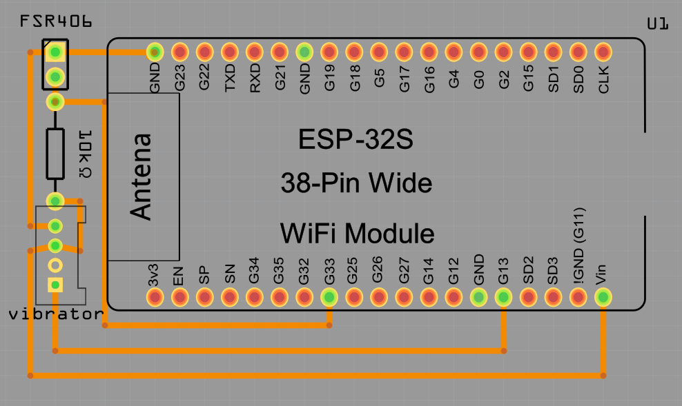

# RHI ( Remort Haptic Interface )

RHIは，Wi-Fi環境下の遠隔地間で仮想的な触感の共有を実現するデバイスです．  

## 開発環境のセットアップ

1. [Arduino core for the ESP32 のインストール](https://www.mgo-tec.com/arduino-core-esp32-install)
2. [SPIFFS アップローダープラグインのインストール](https://www.mgo-tec.com/blog-entry-spiffs-uploader-plugin-arduino-esp32.html)
3. 空の設定ファイル(data/config.txt)を SPIFFS フラッシュへアップロードする  
SPIFFS アップローダープラグインを使い，config.txtをUTF-8形式でアップロードしておく．
4. ライブラリのインストール  
・ [ESP32_WebGet.h](https://github.com/mgo-tec/ESP32_WebGet)  
・ [TimeLib.h](https://github.com/PaulStoffregen/Time)  
※[GitHubにある ZIP形式ライブラリ のインストール方法 ( Arduino IDE )](https://www.mgo-tec.com/arduino-ide-lib-zip-install)
5. コンパイル & 書込み

## 部品
- [ESP-WROOM-32開発ボード](http://akizukidenshi.com/catalog/g/gM-11819/)
- [圧力センサ](http://akizukidenshi.com/catalog/g/gP-04158/)
- [バイブレーションモータ](https://www.switch-science.com/catalog/828/)
- バッテリー
- 抵抗10kΩ 

## ファイル
RemoteHapticInterface.ino：メインプログラム  
data/config.txt：wi-fiパスワードを自動で書き込むファイル  
img/rhi_circuit.PNG：パターン図

## 必要なライブラリ
WiFi.h  
FS.h [(参考URL)](https://www.mgo-tec.com/blog-entry-spiffs-uploader-plugin-arduino-esp32.html)  
SPIFFS.h (同上)  
TimeLib.h [(Github)](https://github.com/PaulStoffregen/Time)  
ESP32_WebGet.h [(Github)](https://github.com/mgo-tec/ESP32_WebGet)  
MQTTClient.h  

## 関連資料
[取扱説明書](https://docs.google.com/presentation/d/1A6hZMrNEB62BZ_IO-AvbB-Tnsj0usCyL3eZcoHlCh6s/edit?usp=sharing)  
[技術仕様書](https://docs.google.com/document/d/1BT33lrkWnVqsaVDk59PR9j5sTTNF2xLjYFqtZrZAetg/edit?usp=sharing)  
